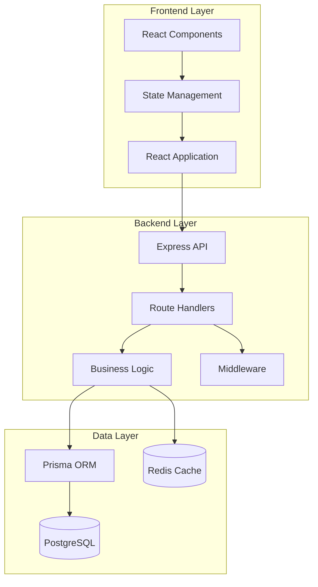

# Developer Guide

Complete guide for developers working on the E-Commerce COD Admin Dashboard.

## Table of Contents

- [Architecture Overview](#architecture-overview)
- [Technology Stack](#technology-stack)
- [Project Structure](#project-structure)
- [Backend Development](#backend-development)
- [Frontend Development](#frontend-development)
- [Database Management](#database-management)
- [API Development](#api-development)
- [State Management](#state-management)
- [Adding New Features](#adding-new-features)
- [Testing](#testing)
- [Code Style & Standards](#code-style--standards)
- [Performance Optimization](#performance-optimization)
- [Security Best Practices](#security-best-practices)
- [Debugging](#debugging)
- [Common Patterns](#common-patterns)

## Architecture Overview

### System Architecture

The application follows a modern three-tier architecture:



### Design Principles

1. **Separation of Concerns**: Clear separation between layers
2. **DRY (Don't Repeat Yourself)**: Reusable components and utilities
3. **SOLID Principles**: Object-oriented design patterns
4. **RESTful API Design**: Standard HTTP methods and status codes
5. **Responsive Design**: Mobile-first approach

### Architecture Patterns

**Backend:**
- **MVC Pattern**: Model-View-Controller separation
- **Service Layer**: Business logic encapsulation
- **Repository Pattern**: Data access abstraction
- **Middleware Pattern**: Request/response processing

**Frontend:**
- **Component-Based Architecture**: Reusable React components
- **Container/Presentational**: Logic vs. presentation separation
- **Custom Hooks**: Reusable stateful logic
- **Context API**: Global state management

## Technology Stack

### Backend Stack

**Core:**
- Node.js 18+ - JavaScript runtime
- Express.js 4+ - Web framework
- TypeScript 5+ - Type-safe JavaScript

**Database:**
- PostgreSQL 15+ - Primary database
- Prisma 5+ - ORM and migration tool
- Redis - Caching (optional)

**Authentication:**
- jsonwebtoken - JWT tokens
- bcrypt - Password hashing

**Validation:**
- Zod - Schema validation

**Utilities:**
- express-rate-limit - Rate limiting
- cors - CORS middleware
- helmet - Security headers
- morgan - Request logging

### Frontend Stack

**Core:**
- React 18.3+ - UI library
- TypeScript 5+ - Type safety
- Vite 5+ - Build tool

**Styling:**
- Tailwind CSS 3.4+ - Utility-first CSS
- Headless UI - Unstyled components

**State & Data:**
- TanStack Query (React Query) - Server state
- React Context - Client state
- Axios - HTTP client

**UI Components:**
- @dnd-kit/core - Drag and drop
- React Hook Form - Form management
- Recharts - Data visualization
- Lucide React - Icons

**Routing:**
- React Router 6+ - Client-side routing

## Project Structure

### Backend Structure

```
backend/
├── prisma/
│   ├── schema.prisma           # Database schema
│   ├── migrations/             # Database migrations
│   └── seed.ts                 # Seed data
├── src/
│   ├── config/
│   │   ├── database.ts         # Database config
│   │   └── env.ts              # Environment variables
│   ├── middleware/
│   │   ├── auth.ts             # Authentication
│   │   ├── validation.ts       # Input validation
│   │   ├── errorHandler.ts     # Error handling
│   │   └── rateLimiter.ts      # Rate limiting
│   ├── routes/
│   │   ├── auth.routes.ts      # Auth endpoints
│   │   ├── order.routes.ts     # Order endpoints
│   │   ├── customer.routes.ts  # Customer endpoints
│   │   ├── product.routes.ts   # Product endpoints
│   │   ├── user.routes.ts      # User endpoints
│   │   ├── workflow.routes.ts  # Workflow endpoints
│   │   └── webhook.routes.ts   # Webhook endpoints
│   ├── services/
│   │   ├── auth.service.ts     # Auth business logic
│   │   ├── order.service.ts    # Order business logic
│   │   ├── customer.service.ts # Customer business logic
│   │   ├── product.service.ts  # Product business logic
│   │   └── workflow.service.ts # Workflow business logic
│   ├── utils/
│   │   ├── jwt.ts              # JWT utilities
│   │   ├── password.ts         # Password utilities
│   │   ├── validation.ts       # Validation helpers
│   │   └── logger.ts           # Logging utility
│   ├── types/
│   │   ├── express.d.ts        # Express type extensions
│   │   └── index.ts            # Shared types
│   ├── app.ts                  # Express app setup
│   └── index.ts                # Server entry point
├── tests/
│   ├── unit/                   # Unit tests
│   └── integration/            # Integration tests
├── .env.example                # Environment template
├── package.json
└── tsconfig.json
```

### Frontend Structure

```
frontend/
├── src/
│   ├── components/
│   │   ├── layout/
│   │   │   ├── Header.tsx
│   │   │   ├── Sidebar.tsx
│   │   │   └── Layout.tsx
│   │   ├── orders/
│   │   │   ├── KanbanBoard.tsx
│   │   │   ├── KanbanColumn.tsx
│   │   │   ├── OrderCard.tsx
│   │   │   ├── OrderDetails.tsx
│   │   │   └── OrderForm.tsx
│   │   ├── customers/
│   │   │   ├── CustomerList.tsx
│   │   │   ├── CustomerCard.tsx
│   │   │   └── CustomerForm.tsx
│   │   ├── products/
│   │   │   ├── ProductList.tsx
│   │   │   ├── ProductCard.tsx
│   │   │   └── ProductForm.tsx
│   │   └── common/
│   │       ├── Button.tsx
│   │       ├── Input.tsx
│   │       ├── Modal.tsx
│   │       └── Table.tsx
│   ├── pages/
│   │   ├── Dashboard.tsx
│   │   ├── Orders.tsx
│   │   ├── Customers.tsx
│   │   ├── Products.tsx
│   │   ├── Analytics.tsx
│   │   └── Settings.tsx
│   ├── hooks/
│   │   ├── useAuth.ts
│   │   ├── useOrders.ts
│   │   ├── useCustomers.ts
│   │   └── useProducts.ts
│   ├── services/
│   │   ├── api.ts              # API client
│   │   ├── auth.ts             # Auth service
│   │   └── storage.ts          # Local storage
│   ├── contexts/
│   │   ├── AuthContext.tsx
│   │   └── ThemeContext.tsx
│   ├── utils/
│   │   ├── format.ts           # Formatting utilities
│   │   ├── validation.ts       # Validation helpers
│   │   └── constants.ts        # Constants
│   ├── types/
│   │   └── index.ts            # TypeScript types
│   ├── styles/
│   │   └── globals.css         # Global styles
│   ├── App.tsx                 # App component
│   └── main.tsx                # Entry point
├── public/
│   ├── favicon.ico
│   └── assets/
├── .env.example
├── package.json
├── tsconfig.json
├── tailwind.config.js
└── vite.config.ts
```

## Backend Development

### Setting Up Development Environment

1. **Install Dependencies**
```bash
cd backend
npm install
```

2. **Configure Environment**
```bash
cp .env.example .env
# Edit .env with your settings
```

3. **Setup Database**
```bash
npx prisma migrate dev
npx prisma db seed
```

4. **Start Development Server**
```bash
npm run dev
```

### Creating a New Route

**Step 1: Define Route Handler**

```typescript
// src/routes/example.routes.ts
import { Router } from 'express';
import { authenticate } from '../middleware/auth';
import { validate } from '../middleware/validation';
import { ExampleService } from '../services/example.service';
import { createExampleSchema } from '../schemas/example.schema';

const router = Router();
const exampleService = new ExampleService();

// GET /api/examples
router.get('/', authenticate, async (req, res, next) => {
  try {
    const examples = await exampleService.getAll();
    res.json({
      success: true,
      data: examples
    });
  } catch (error) {
    next(error);
  }
});

// POST /api/examples
router.post('/', 
  authenticate,
  validate(createExampleSchema),
  async (req, res, next) => {
    try {
      const example = await exampleService.create(req.body);
      res.status(201).json({
        success: true,
        data: example
      });
    } catch (error) {
      next(error);
    }
  }
);

export default router;
```

**Step 2: Create Service**

```typescript
// src/services/example.service.ts
import { PrismaClient } from '@prisma/client';

const prisma = new PrismaClient();

export class ExampleService {
  async getAll() {
    return await prisma.example.findMany({
      orderBy: { createdAt: 'desc' }
    });
  }

  async getById(id: string) {
    const example = await prisma.example.findUnique({
      where: { id }
    });
    
    if (!example) {
      throw new Error('Example not found');
    }
    
    return example;
  }

  async create(data: any) {
    return await prisma.example.create({
      data
    });
  }

  async update(id: string, data: any) {
    return await prisma.example.update({
      where: { id },
      data
    });
  }

  async delete(id: string) {
    return await prisma.example.delete({
      where: { id }
    });
  }
}
```

**Step 3: Create Validation Schema**

```typescript
// src/schemas/example.schema.ts
import { z } from 'zod';

export const createExampleSchema = z.object({
  body: z.object({
    name: z.string().min(1, 'Name is required'),
    description: z.string().optional(),
    value: z.number().positive()
  })
});

export const updateExampleSchema = z.object({
  params: z.object({
    id: z.string().uuid()
  }),
  body: z.object({
    name: z.string().min(1).optional(),
    description: z.string().optional(),
    value: z.number().positive().optional()
  })
});
```

**Step 4: Register Route**

```typescript
// src/app.ts
import exampleRoutes from './routes/example.routes';

app.use('/api/examples', exampleRoutes);
```

### Middleware Development

**Custom Middleware Pattern:**

```typescript
// src/middleware/customMiddleware.ts
import { Request, Response, NextFunction } from 'express';

export const customMiddleware = (options?: any) => {
  return async (req: Request, res: Response, next: NextFunction) => {
    try {
      // Middleware logic here
      
      // Modify request
      req.customProperty = 'value';
      
      // Continue to next middleware
      next();
    } catch (error) {
      next(error);
    }
  };
};
```

### Error Handling

**Custom Error Classes:**

```typescript
// src/utils/errors.ts
export class AppError extends Error {
  constructor(
    public message: string,
    public statusCode: number = 500,
    public code?: string
  ) {
    super(message);
    this.name = this.constructor.name;
    Error.captureStackTrace(this, this.constructor);
  }
}

export class ValidationError extends AppError {
  constructor(message: string) {
    super(message, 400, 'VALIDATION_ERROR');
  }
}

export class NotFoundError extends AppError {
  constructor(resource: string) {
    super(`${resource} not found`, 404, 'NOT_FOUND');
  }
}

export class UnauthorizedError extends AppError {
  constructor(message: string = 'Unauthorized') {
    super(message, 401, 'UNAUTHORIZED');
  }
}
```

**Error Handler Middleware:**

```typescript
// src/middleware/errorHandler.ts
import { Request, Response, NextFunction } from 'express';
import { AppError } from '../utils/errors';

export const errorHandler = (
  err: Error,
  req: Request,
  res: Response,
  next: NextFunction
) => {
  if (err instanceof AppError) {
    return res.status(err.statusCode).json({
      success: false,
      error: {
        code: err.code,
        message: err.message
      }
    });
  }

  // Prisma errors
  if (err.name === 'PrismaClientKnownRequestError') {
    return res.status(400).json({
      success: false,
      error: {
        code: 'DATABASE_ERROR',
        message: 'Database operation failed'
      }
    });
  }

  // Default error
  console.error('Unhandled error:', err);
  res.status(500).json({
    success: false,
    error: {
      code: 'INTERNAL_ERROR',
      message: 'An unexpected error occurred'
    }
  });
};
```

## Frontend Development

### Setting Up Development Environment

1. **Install Dependencies**
```bash
cd frontend
npm install
```

2. **Configure Environment**
```bash
cp .env.example .env
# Edit .env with API URL
```

3. **Start Development Server**
```bash
npm run dev
```

### Creating a New Component

**Functional Component with TypeScript:**

```typescript
// src/components/example/ExampleComponent.tsx
import React, { useState } from 'react';

interface ExampleComponentProps {
  title: string;
  onAction?: () => void;
  children?: React.ReactNode;
}

export const ExampleComponent: React.FC<ExampleComponentProps> = ({
  title,
  onAction,
  children
}) => {
  const [isActive, setIsActive] = useState(false);

  const handleClick = () => {
    setIsActive(!isActive);
    onAction?.();
  };

  return (
    <div className={`example-component ${isActive ? 'active' : ''}`}>
      <h2 className="text-xl font-bold">{title}</h2>
      <button
        onClick={handleClick}
        className="px-4 py-2 bg-blue-500 text-white rounded"
      >
        Toggle
      </button>
      {children}
    </div>
  );
};
```

### Creating Custom Hooks

**Data Fetching Hook:**

```typescript
// src/hooks/useExamples.ts
import { useQuery, useMutation, useQueryClient } from '@tanstack/react-query';
import { api } from '../services/api';

interface Example {
  id: string;
  name: string;
  description?: string;
  value: number;
}

export const useExamples = () => {
  return useQuery({
    queryKey: ['examples'],
    queryFn: async () => {
      const response = await api.get<{ data: Example[] }>('/examples');
      return response.data.data;
    }
  });
};

export const useExample = (id: string) => {
  return useQuery({
    queryKey: ['examples', id],
    queryFn: async () => {
      const response = await api.get<{ data: Example }>(`/examples/${id}`);
      return response.data.data;
    },
    enabled: !!id
  });
};

export const useCreateExample = () => {
  const queryClient = useQueryClient();

  return useMutation({
    mutationFn: async (data: Omit<Example, 'id'>) => {
      const response = await api.post<{ data: Example }>('/examples', data);
      return response.data.data;
    },
    onSuccess: () => {
      queryClient.invalidateQueries({ queryKey: ['examples'] });
    }
  });
};

export const useUpdateExample = () => {
  const queryClient = useQueryClient();

  return useMutation({
    mutationFn: async ({ id, data }: { id: string; data: Partial<Example> }) => {
      const response = await api.put<{ data: Example }>(`/examples/${id}`, data);
      return response.data.data;
    },
    onSuccess: (_, variables) => {
      queryClient.invalidateQueries({ queryKey: ['examples'] });
      queryClient.invalidateQueries({ queryKey: ['examples', variables.id] });
    }
  });
};

export const useDeleteExample = () => {
  const queryClient = useQueryClient();

  return useMutation({
    mutationFn: async (id: string) => {
      await api.delete(`/examples/${id}`);
    },
    onSuccess: () => {
      queryClient.invalidateQueries({ queryKey: ['examples'] });
    }
  });
};
```

### Form Handling

**Form with React Hook Form and Zod:**

```typescript
// src/components/forms/ExampleForm.tsx
import React from 'react';
import { useForm } from 'react-hook-form';
import { zodResolver } from '@hookform/resolvers/zod';
import { z } from 'zod';

const exampleSchema = z.object({
  name: z.string().min(1, 'Name is required'),
  description: z.string().optional(),
  value: z.number().positive('Value must be positive')
});

type ExampleFormData = z.infer<typeof exampleSchema>;

interface ExampleFormProps {
  initialData?: ExampleFormData;
  onSubmit: (data: ExampleFormData) => void;
  onCancel?: () => void;
}

export const ExampleForm: React.FC<ExampleFormProps> = ({
  initialData,
  onSubmit,
  onCancel
}) => {
  const {
    register,
    handleSubmit,
    formState: { errors, isSubmitting }
  } = useForm<ExampleFormData>({
    resolver: zodResolver(exampleSchema),
    defaultValues: initialData
  });

  return (
    <form onSubmit={handleSubmit(onSubmit)} className="space-y-4">
      <div>
        <label htmlFor="name" className="block text-sm font-medium">
          Name
        </label>
        <input
          {...register('name')}
          type="text"
          id="name"
          className="mt-1 block w-full rounded-md border-gray-300"
        />
        {errors.name && (
          <p className="mt-1 text-sm text-red-600">{errors.name.message}</p>
        )}
      </div>

      <div>
        <label htmlFor="description" className="block text-sm font-medium">
          Description
        </label>
        <textarea
          {...register('description')}
          id="description"
          rows={3}
          className="mt-1 block w-full rounded-md border-gray-300"
        />
      </div>

      <div>
        <label htmlFor="value" className="block text-sm font-medium">
          Value
        </label>
        <input
          {...register('value', { valueAsNumber: true })}
          type="number"
          id="value"
          className="mt-1 block w-full rounded-md border-gray-300"
        />
        {errors.value && (
          <p className="mt-1 text-sm text-red-600">{errors.value.message}</p>
        )}
      </div>

      <div className="flex justify-end space-x-3">
        {onCancel && (
          <button
            type="button"
            onClick={onCancel}
            className="px-4 py-2 border rounded-md"
          >
            Cancel
          </button>
        )}
        <button
          type="submit"
          disabled={isSubmitting}
          className="px-4 py-2 bg-blue-500 text-white rounded-md disabled:opacity-50"
        >
          {isSubmitting ? 'Submitting...' : 'Submit'}
        </button>
      </div>
    </form>
  );
};
```

## Database Management

### Prisma Schema Design

**Example Model:**

```prisma
// prisma/schema.prisma
model Example {
  id          String   @id @default(uuid())
  name        String
  description String?
  value       Float
  active      Boolean  @default(true)
  createdAt   DateTime @default(now())
  updatedAt   DateTime @updatedAt

  // Relations
  userId      String
  user        User     @relation(fields: [userId], references: [id])

  @@index([userId])
  @@index([active])
  @@map("examples")
}
```

### Creating Migrations

```bash
# Create a new migration
npx prisma migrate dev --name add_example_model

# Apply migrations
npx prisma migrate deploy

# Reset database (DEV ONLY)
npx prisma migrate reset
```

### Seeding Database

```typescript
// prisma/seed.ts
import { PrismaClient } from '@prisma/client';

const prisma = new PrismaClient();

async function main() {
  // Create users
  const admin = await prisma.user.create({
    data: {
      email: 'admin@example.com',
      password: 'hashedPassword',
      name: 'Admin User',
      role: 'ADMIN'
    }
  });

  // Create examples
  await prisma.example.createMany({
    data: [
      { name: 'Example 1', value: 100, userId: admin.id },
      { name: 'Example 2', value: 200, userId: admin.id }
    ]
  });

  console.log('Database seeded successfully');
}

main()
  .catch((e) => {
    console.error(e);
    process.exit(1);
  })
  .finally(async () => {
    await prisma.$disconnect();
  });
```

## API Development

### RESTful API Best Practices

**Endpoint Naming:**
- Use nouns, not verbs: `/orders` not `/getOrders`
- Use plural forms: `/orders` not `/order`
- Use hyphens for multi-word: `/order-items`
- Nested resources: `/orders/:id/items`

**HTTP Methods:**
- `GET` - Retrieve resources
- `POST` - Create new resource
- `PUT` - Update entire resource
- `PATCH` - Partial update
- `DELETE` - Delete resource

**Status Codes:**
- `200 OK` - Successful GET, PUT, PATCH, DELETE
- `201 Created` - Successful POST
- `204 No Content` - Successful DELETE (no body)
- `400 Bad Request` - Validation error
- `401 Unauthorized` - Authentication required
- `403 Forbidden` - Insufficient permissions
- `404 Not Found` - Resource not found
- `409 Conflict` - Resource conflict
- `500 Internal Server Error` - Server error

### Response Format

**Consistent Response Structure:**

```typescript
// Success response
{
  "success": true,
  "data": { /* response data */ },
  "meta": {
    "timestamp": "2025-10-08T10:00:00Z"
  }
}

// Error response
{
  "success": false,
  "error": {
    "code": "ERROR_CODE",
    "message": "Error message",
    "details": [/* validation errors */]
  }
}

// Paginated response
{
  "success": true,
  "data": [/* items */],
  "pagination": {
    "total": 100,
    "page": 1,
    "limit": 20,
    "totalPages": 5
  }
}
```

## State Management

### React Query for Server State

```typescript
// Query configuration
import { QueryClient } from '@tanstack/react-query';

export const queryClient = new QueryClient({
  defaultOptions: {
    queries: {
      staleTime: 5 * 60 * 1000, // 5 minutes
      cacheTime: 10 * 60 * 1000, // 10 minutes
      refetchOnWindowFocus: false,
      retry: 1
    }
  }
});
```

### Context for Client State

```typescript
// src/contexts/ExampleContext.tsx
import React, { createContext, useContext, useState } from 'react';

interface ExampleContextType {
  value: string;
  setValue: (value: string) => void;
}

const ExampleContext = createContext<ExampleContextType | undefined>(undefined);

export const ExampleProvider: React.FC<{ children: React.ReactNode }> = ({
  children
}) => {
  const [value, setValue] = useState('');

  return (
    <ExampleContext.Provider value={{ value, setValue }}>
      {children}
    </ExampleContext.Provider>
  );
};

export const useExample = () => {
  const context = useContext(ExampleContext);
  if (!context) {
    throw new Error('useExample must be used within ExampleProvider');
  }
  return context;
};
```

## Adding New Features

### Feature Development Workflow

1. **Plan the Feature**
   - Define requirements
   - Design database schema (if needed)
   - Plan API endpoints
   - Design UI/UX

2. **Backend Development**
   - Create/update Prisma schema
   - Run migrations
   - Create service layer
   - Create route handlers
   - Add validation schemas
   - Write tests

3. **Frontend Development**
   - Create TypeScript types
   - Create API service functions
   - Create custom hooks
   - Build UI components
   - Add routing
   - Write tests

4. **Testing & QA**
   - Unit tests
   - Integration tests
   - Manual testing
   - Performance testing

5. **Documentation**
   - Update API documentation
   - Update user guide
   - Add code comments
   - Create examples

## Testing

### Backend Testing

**Unit Tests:**

```typescript
// tests/unit/services/example.service.test.ts
import { ExampleService } from '../../../src/services/example.service';
import { PrismaClient } from '@prisma/client';

jest.mock('@prisma/client');

describe('ExampleService', () => {
  let service: ExampleService;
  let prisma: jest.Mocked<PrismaClient>;

  beforeEach(() => {
    prisma = new PrismaClient() as jest.Mocked<PrismaClient>;
    service = new ExampleService();
  });

  describe('getAll', () => {
    it('should return all examples', async () => {
      const mockExamples = [
        { id: '1', name: 'Example 1', value: 100 },
        { id: '2', name: 'Example 2', value: 200 }
      ];

      prisma.example.findMany.mockResolvedValue(mockExamples);

      const result = await service.getAll();

      expect(result).toEqual(mockExamples);
      expect(prisma.example.findMany).toHaveBeenCalledTimes(1);
    });
  });
});
```

**Integration Tests:**

```typescript
// tests/integration/routes/example.routes.test.ts
import request from 'supertest';
import app from '../../../src/app';

describe('Example Routes', () => {
  let authToken: string;

  beforeAll(async () => {
    // Login and get token
    const response = await request(app)
      .post('/api/auth/login')
      .send({
        email: 'test@example.com',
        password: 'password'
      });
    
    authToken = response.body.data.token;
  });

  describe('GET /api/examples', () => {
    it('should return list of examples', async () => {
      const response = await request(app)
        .get('/api/examples')
        .set('Authorization', `Bearer ${authToken}`)
        .expect(200);

      expect(response.body.success).toBe(true);
      expect(Array.isArray(response.body.data)).toBe(true);
    });

    it('should return 401 without auth', async () => {
      await request(app)
        .get('/api/examples')
        .expect(401);
    });
  });
});
```

### Frontend Testing

**Component Tests:**

```typescript
// src/components/__tests__/ExampleComponent.test.tsx
import { render, screen, fireEvent } from '@testing-library/react';
import { ExampleComponent } from '../ExampleComponent';

describe('ExampleComponent', () => {
  it('renders title correctly', () => {
    render(<ExampleComponent title="Test Title" />);
    expect(screen.getByText('Test Title')).toBeInTheDocument();
  });

  it('toggles active state on click', () => {
    const onAction = jest.fn();
    render(<ExampleComponent title="Test" onAction={onAction} />);
    
    const button = screen.getByText('Toggle');
    fireEvent.click(button);
    
    expect(onAction).toHaveBeenCalledTimes(1);
  });
});
```

**Hook Tests:**

```typescript
// src/hooks/__tests__/useExamples.test.ts
import { renderHook, waitFor } from '@testing-library/react';
import { QueryClient, QueryClientProvider } from '@tanstack/react-query';
import { useExamples } from '../useExamples';

const createWrapper = () => {
  const queryClient = new QueryClient();
  return ({ children }: any) => (
    <QueryClientProvider client={queryClient}>
      {children}
    </QueryClientProvider>
  );
};

describe('useExamples', () => {
  it('fetches examples successfully', async () => {
    const { result } = renderHook(() => useExamples(), {
      wrapper: createWrapper()
    });

    await waitFor(() => expect(result.current.isSuccess).toBe(true));
    
    expect(result.current.data).toBeDefined();
  });
});
```

## Code Style & Standards

### TypeScript Best Practices

```typescript
// Use explicit types
interface User {
  id: string;
  email: string;
  name: string;
}

// Use type guards
function isUser(obj: any): obj is User {
  return 'id' in obj && 'email' in obj && 'name' in obj;
}

// Use const assertions
const STATUS = {
  PENDING: 'PENDING',
  CONFIRMED: 'CONFIRMED'
} as const;

type Status = typeof STATUS[keyof typeof STATUS];

// Use utility types
type PartialUser = Partial<User>;
type UserWithoutId = Omit<User, 'id'>;
```

### Naming Conventions

- **Variables**: camelCase - `userName`, `orderTotal`
- **Functions**: camelCase - `getUserById`, `calculateTotal`
- **Classes**: PascalCase - `UserService`, `OrderController`
- **Components**: PascalCase - `OrderCard`, `CustomerList`
- **Constants**: UPPER_SNAKE_CASE - `API_URL`, `MAX_RETRIES`
- **Types/Interfaces**: PascalCase - `User`, `OrderStatus`

### Code Organization

```typescript
// Imports order:
// 1. External libraries
import React from 'react';
import { useState } from 'react';
import axios from 'axios';

// 2. Internal modules
import { api } from '@/services/api';
import { useAuth } from '@/hooks/useAuth';

// 3. Components
import { Button } from '@/components/Button';
import { Input } from '@/components/Input';

// 4. Types
import type { User, Order } from '@/types';

// 5. Styles
import './styles.css';
```

## Performance Optimization

### Backend Optimization

**Database Query Optimization:**

```typescript
// Bad: N+1 query problem
const orders = await prisma.order.findMany();
for (const order of orders) {
  const customer = await prisma.customer.findUnique({
    where: { id: order.customerId }
  });
}

// Good: Use include/select
const orders = await prisma.order.findMany({
  include: {
    customer: true,
    items: {
      include: {
        product: true
      }
    }
  }
});
```

**Caching:**

```typescript
import Redis from 'ioredis';

const redis = new Redis(process.env.REDIS_URL);

async function getCachedData(key: string, fetcher: () => Promise<any>) {
  const cached = await redis.get(key);
  
  if (cached) {
    return JSON.parse(cached);
  }
  
  const data = await fetcher();
  await redis.set(key, JSON.stringify(data), 'EX', 3600); // 1 hour
  
  return data;
}
```

### Frontend Optimization

**Code Splitting:**

```typescript
// Lazy load components
import { lazy, Suspense } from 'react';

const Dashboard = lazy(() => import('./pages/Dashboard'));
const Orders = lazy(() => import('./pages/Orders'));

function App() {
  return (
    <Suspense fallback={<div>Loading...</div>}>
      <Routes>
        <Route path="/dashboard" element={<Dashboard />} />
        <Route path="/orders" element={<Orders />} />
      </Routes>
    </Suspense>
  );
}
```

**Memoization:**

```typescript
import { useMemo, useCallback } from 'react';

function ExpensiveComponent({ data }) {
  // Memoize expensive calculations
  const processedData = useMemo(() => {
    return data.map(item => expensiveOperation(item));
  }, [data]);

  // Memoize callbacks
  const handleClick = useCallback(() => {
    doSomething(processedData);
  }, [processedData]);

  return <div onClick={handleClick}>{/* ... */}</div>;
}
```

## Security Best Practices

See [SECURITY_GUIDE.md](SECURITY_GUIDE.md) for comprehensive security guidelines.

## Debugging

### Backend Debugging

**Using VS Code Debugger:**

```json
// .vscode/launch.json
{
  "version": "0.2.0",
  "configurations": [
    {
      "type": "node",
      "request": "launch",
      "name": "Debug Backend",
      "runtimeExecutable": "npm",
      "runtimeArgs": ["run", "dev"],
      "skipFiles": ["<node_internals>/**"],
      "envFile": "${workspaceFolder}/backend/.env"
    }
  ]
}
```

**Logging:**

```typescript
import { logger } from './utils/logger';

logger.info('Info message');
logger.error('Error message', { error });
logger.debug('Debug message', { data });
```

### Frontend Debugging

**React DevTools:**
- Install React Developer Tools extension
- Inspect component tree
- View props and state
- Profile performance

**Network Debugging:**
- Use browser DevTools Network tab
- Monitor API requests
- Check request/response data
- Analyze timing

## Common Patterns

### Repository Pattern

```typescript
// repositories/base.repository.ts
export abstract class BaseRepository<T> {
  constructor(protected model: any) {}

  async findAll(): Promise<T[]> {
    return await this.model.findMany();
  }

  async findById(id: string): Promise<T | null> {
    return await this.model.findUnique({ where: { id } });
  }

  async create(data: Partial<T>): Promise<T> {
    return await this.model.create({ data });
  }

  async update(id: string, data: Partial<T>): Promise<T> {
    return await this.model.update({ where: { id }, data });
  }

  async delete(id: string): Promise<T> {
    return await this.model.delete({ where: { id } });
  }
}
```

### Dependency Injection

```typescript
// services/order.service.ts
export class OrderService {
  constructor(
    private orderRepository: OrderRepository,
    private emailService: EmailService,
    private workflowService: WorkflowService
  ) {}

  async createOrder(data: CreateOrderDto) {
    const order = await this.orderRepository.create(data);
    await this.emailService.sendOrderConfirmation(order);
    await this.workflowService.processOrder(order);
    return order;
  }
}
```

---

**For more information, see:**
- [API Documentation](API_DOCUMENTATION.md)
- [Security Guide](SECURITY_GUIDE.md)
- [Deployment Guide](DEPLOYMENT_GUIDE.md)

**Last Updated:** 2025-10-08
